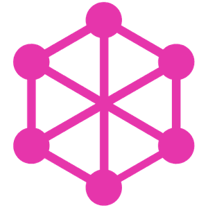

 

  
# Hi There!!! 

I'm Shaurya Jain a Full Stack Web Developer.

- 🔭 I’m currently working as Frontend Developer at [Infosys](https://www.infosys.com/).
- :computer: Current Stack : MERN and Apache Solr
- 📫 Hreach me at : shaurya.jain.email@gmail.com.
- ⚡ Fun fact: I play games on my PS5 and go to the GYM very often.
- Hobbies : Reading Books (Not the self-help crap) and Photo Editing.

  

 

 

### Top Technologies

 
 
 
 

### Tools & Technologies

  

  More stuff about me

#### Profile Visits

 

  
|  |  |
| ------------- | ------------- |
  

  

 
 
  
  

 

# Hi, I'm Kaiz Khatri 👋

- pronouns: **he**/**him**

- tech hipster

- gifted artist.

- **opensourcer**

- bachelor of computer science

- support me on **[liberapay](https://liberapay.com/ful1e5)** or [Patreon](https://www.patreon.com/KaizKhatri)

 

  

<!-- Discord: https://discord.gg/2RjkTNK -->
<!-- Twitch: https://www.twitch.tv/ful1e5 -->

  
  
  
  
  

© 2022 GitHub, Inc.
Term
