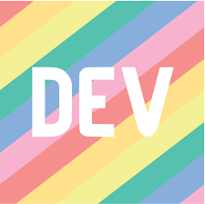

  

  
# Hi There!!! 

I'm a Full Stack Web Developer from Inida 🇮🇳

**ABOUT ME**
 

- 🔭 Frontend Developer at [Infosys](https://www.infosys.com/).
- :computer: Current Stack : MERN and Apache Solr.
- 📫 Reach me at : shaurya.jain.email@gmail.com.
- ⚡ Fun fact: I play games on PS5 and go to the GYM very often.
- ❤️ Hobbies : Reading Books (Not the self-help crap) and Photo Editing.

 

## Top Technologies

 
 
 
 

## Tools & Technologies

  

## Github Stats 

 

  
Break It !!!
 
<!--   -->

## Connect with me

  <a href="https://www.linkedin.com/in/shaurya-jain-24mar/" target="_blank" >
<!--      -->
    
  </a>
  <a href="https://www.instagram.com/_shaur_/" target="_blank" >
<!--      -->
    
  </a>
  <a href="https://twitter.com/j_shaur" target="_blank" >
<!--      -->
    
  </a>
  <a href="https://dev.to/shaur" target="_blank" >
<!--      -->
    
  </a>
  

 
